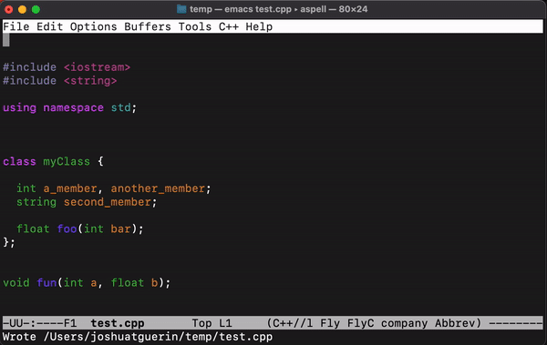
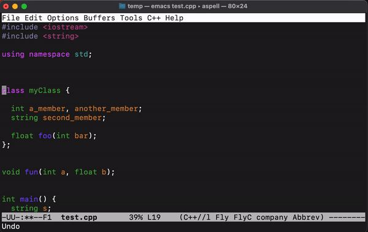

# doqmnt - Auto-documentation in Emacs for programmers.
Doqmnt (pronounced: "document") is a free library for Emacs that assists with source code documentation for programmers.

Currently doqmnt only supports a pre-configured doxygen format. We hope to update this later to include more documentation standards (e.g., Javadoc), and more flexible formatting of documentation.

## Motivation
It was developed by Joshua T. Guerin, Ph.D. and Kathleen Ericson, Ph.D. at the University of Tennessee at Martin for use in our introductory programming courses. Our hope is to aid in the documentation/development process by reducing overall keystrokes and workload of creating documentation.

And you are correct--documentation is not difficult, but in our experience many student programmers tend to view documentation as something to address before submission. By streamlining the process we hope to make engaging in the documentation process early to be a more attractive proposition.

Doqmnt is not just meant for students/academic use--we hope to one day have the project mature enough that programmers in the wild may discover it and choose to use it.

## Installation
At the moment doqmnt is only located in this github repository (i.e., not in melpa) due to its immaturity. This may change over time.

There are only two steps to install on most *nix systems, and the process is fairly similar for most .el files.

**1. Download the .el file, and put it somewhere safe on your system.**

At the moment we are installing doqmnt on a per-user basis, and we are adding it to `~/.emacs.d/include` (the `include` directory will likely need to be created.

**2. Update your .emacs file to add the directory to your load path, load the doqmnt.el**

The following lines of code added to your .emacs file should do the trick:

```
; Add .emacs.d to load path
(add-to-list 'load-path "~/.emacs.d/include")

; Load doqmnt.el on load of Emacs
(load "doqmnt.el")
```

If you chose to put doqmnt somewhere other than `~/.emacs.d/include` you can change the above to reflect the correct directory.

## Usage
If Emacs loads happily after installation, it is likely that doqmnt will work.

Doqmnt implements the following commands, that are accessible with "M-x command".

`file-doq`


- Should be ran at the top of a source file.
- Adds a pre-configured header comment, scraping what information it can from the system (e.g., user name, date).


`fun-doq`


- Can be ran anywhere on the line containing a prototype for a function.
- Generates a pre-configured function/method comment *before* the prototype.
- Cursor is returned to the starting point afterward.
- Currently works only with C/C++/Java style prototypes.
- Parses the line and extracts whatever relevant information exists.
 - E.g., Function identifier, return value, parameter list.


`class-doq`


- Can be ran anywhere on the line containing the start of the class declaration.
- Generates a pre-configured function/method comment *before* the class declaration.
- Cursor is returned to the starting point afterward.
- Currently works only with C/C++/Java style prototypes.
- Parses the line and extracts the class name.

All implemented commands currently work in an interactive mode we are developing. The minbuffer will prompt the user for information that cannot be generated automatically by the system (e.g., descriptions of items). You can type up an entry and simply hit `return` or `enter` to move on to the next. The documentation is generated automatically, in pieces until the function is done running.

## Dependencies & Portability
At the moment, doqmnt is written for the Emacs editor in Lisp, and is intended for Unix-like systems. This *should* include (but is not necessarily limited to):
- Most versions of Linux.
- The Windows Subsystem for Linux (WSL).
- macOS, OS X.

`file-doq`:
In order to automatically populate the programmer's name and the current date, file-doq uses the currently defined value `user-full-name` in Emacs, and the shell commands `echo` and `date` to generate the current date.

If the user's full name is not populating correctly (e.g., nil or unknown) it may be worth setting the variable value in your .emacs. The value of `user-full-name` is may not evaluate correctly in some circumstances (e.g., if the Emacs process is not owned by a specific user), however we currently don't know how likely these sorts of circumstances will be in practice.

At the moment we consider both of these mostly/somewhat portable for the target systems. We are likely to consider different approaches as we continue to test and develop the library.

The remainder is written in pure (albeit at the moment not very functional) Emacs lisp, so we suspect most of the functionality will work on most systems.

## Bugs and Feature Requests

You are welcome to submit an [issue](https://github.com/joshuaguerin/doqmnt/issues)! (Just make sure to check the FAQ and current/closed issues first for duplicates or existing conversations you could respond to.)

Please be aware that this is a project we are doing for fun for ourselves and our students. Responsiveness may be an issue for us at the wrong time of year, and we may not be able to prioritize requests that appear to take a lot of time.


## FAQ

```The name doqmnt is terribly silly.```

Yes! It was one of about a dozen silly candidates we threw around. We wanted something short and somewhat descriptive, and desired to avoid names that appeared to be taken by other companies or repos. Online searches for doqmnt turned up very little, and there were no repos with that name.


```Your code isn't very good.```

Thanks for looking! You are also correct, by our standards as well. :wink: The initial commits/version of doqmnt were primarily the result of about an afternoon of hacking with some of us barely recalling Lisp. We were trying to answer the question of "can we do something like this for our students." The result *seems* to be "yes."

But, yes, minimally we want to take a pass later that involves basic refactoring and structuring things in a functional manner in Emacs Lisp. We may feel similar about `interactive`, `setq`, etc., but this was also the quickest way that we could throw something together in said afternoon while also refreshing our memory on a lot of Lisp stuff.

```Can I send you a bug?```

Yes, submit and [issue](https://github.com/joshuaguerin/doqmnt/issues)! Please be specific about the nature of the system, setup, and nature of the bug. Please check first to make sure that it wasn't already covered in another conversation.

```Can I submit a feature request?```

Why not? Please also submit an [issue](https://github.com/joshuaguerin/doqmnt/issues). Just be warned, that we currently have no real way of prioritizing these sorts of things, and we will probably make somewhat arbitrary decisions that are motivated by "How much time will this take us?", "How useful will this be given the current state of the project?", or even "How interesting do we find the idea at this moment."

```Did anyone actually ask these questions, irrespective of the degree of frequency?```

No, but it felt right to express some information in this manner.
